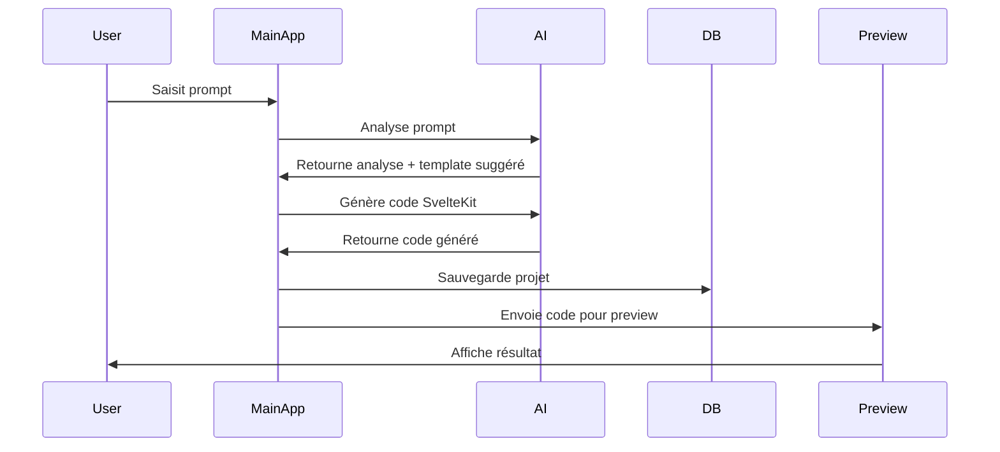
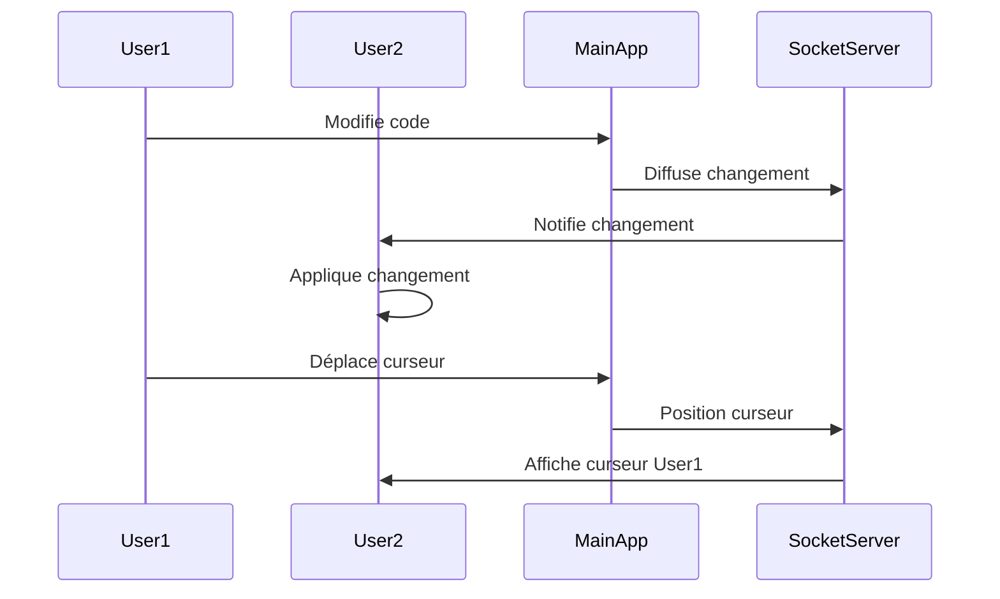

# Guide Technique - Constructor V3

## Vue d'ensemble de l'architecture

Constructor V3 est une application de génération de code SvelteKit basée sur l'IA, organisée sous forme de monorepo Turborepo.

### Structure du projet

```
constructor-v3/
├── apps/                    # Applications
│   ├── main/               # App principale (5173)
│   ├── preview/            # Preview isolée (5174)
│   └── admin/              # Dashboard admin (5176)
├── packages/               # Packages partagés
│   ├── ui/                 # Composants Svelte
│   ├── db/                 # Utilitaires Supabase
│   ├── ai/                 # Logique IA (LangChain/OpenAI)
│   └── editor/             # Monaco + collaboration
├── scripts/                # Scripts utilitaires
└── docs/                   # Documentation
```

## Applications

### Main App (Port 5173)
**Rôle** : Interface utilisateur principale avec chat IA et éditeur Monaco

**Fonctionnalités principales** :
- Chat intelligent avec IA pour générer du code
- Éditeur Monaco intégré avec syntaxe highlighting Svelte
- Preview en temps réel via iframe
- Gestion de projets utilisateur
- Collaboration temps réel (curseurs partagés)

**Technologies** :
- SvelteKit pour le routing et SSR
- Monaco Editor pour l'édition de code
- Socket.io client pour la collaboration
- TailwindCSS pour le styling
- Supabase pour la persistance

### Preview App (Port 5174)
**Rôle** : Environnement isolé pour afficher les applications générées

**Fonctionnalités principales** :
- Compilation à la volée du code généré
- Hot reloading ultra-rapide avec Vite
- Environnement sandboxé sécurisé
- Communication avec l'app principale

**Technologies** :
- SvelteKit avec Vite pour le hot reloading
- Isolation via iframe depuis l'app principale
- Socket.io pour recevoir les mises à jour de code

### Admin App (Port 5176)
**Rôle** : Dashboard d'administration pour gérer templates et composants

**Fonctionnalités principales** :
- Statistiques d'utilisation (projets, prompts, templates)
- CRUD pour templates de projets
- CRUD pour composants réutilisables
- Analyse des prompts populaires
- Gestion des utilisateurs

**Technologies** :
- SvelteKit pour l'interface
- Chart.js pour les graphiques
- Supabase pour les données d'administration
- Interface optimisée pour les opérations CRUD

## Packages Partagés

### @constructor-v3/ui
**Rôle** : Composants Svelte réutilisables style ShadCN

**Composants inclus** :
- `Button` - Boutons avec variants (primary, secondary, etc.)
- `Card` - Cartes avec header/content/footer
- `Modal` - Modales avec overlay et gestion du focus
- `Input` - Champs de saisie avec validation
- `Header` - En-tête de navigation

**API** :
```javascript
import { Button, Card, Modal } from '@constructor-v3/ui';
```

### @constructor-v3/db
**Rôle** : Types TypeScript et requêtes Supabase

**Fonctionnalités** :
- Client Supabase configuré
- Types TypeScript pour toutes les tables
- Requêtes prêtes à l'emploi (`promptQueries`, `templateQueries`, etc.)
- Utilitaires pour les statistiques admin

**API** :
```javascript
import { supabase, promptQueries, templateQueries } from '@constructor-v3/db';

// Récupérer tous les templates
const { data, error } = await templateQueries.getAll();
```

### @constructor-v3/ai
**Rôle** : Logique d'IA avec LangChain et OpenAI

**Classes principales** :
- `SvelteKitGenerator` - Génération de code SvelteKit
- `PromptAnalyzer` - Analyse des prompts utilisateur
- Templates prédéfinis pour différents types de projets

**API** :
```javascript
import { SvelteKitGenerator, PromptAnalyzer } from '@constructor-v3/ai';

const generator = new SvelteKitGenerator();
const result = await generator.generateFromPrompt(
  "un site e-commerce pour vêtements",
  "e-commerce",
  []
);
```

### @constructor-v3/editor
**Rôle** : Monaco Editor avec collaboration temps réel

**Composants** :
- `MonacoEditor.svelte` - Composant Svelte pour Monaco
- `CollaborationManager` - Gestion de la collaboration Socket.io
- `MonacoCollaboration` - Intégration Monaco + collaboration

**API** :
```svelte
<script>
  import { MonacoEditor } from '@constructor-v3/editor';
  
  let code = '';
</script>

<MonacoEditor 
  bind:value={code}
  language="svelte"
  theme="constructor-dark"
  filename="App.svelte"
/>
```

## Schéma de base de données

### Tables principales

```sql
-- Templates de projets
CREATE TABLE templates (
  id SERIAL PRIMARY KEY,
  name TEXT NOT NULL,
  type TEXT NOT NULL, -- 'e-commerce', 'crm', 'blog', etc.
  structure JSONB NOT NULL, -- Structure des routes/composants
  created_at TIMESTAMP DEFAULT NOW()
);

-- Composants réutilisables  
CREATE TABLE components (
  id SERIAL PRIMARY KEY,
  name TEXT NOT NULL,
  type TEXT NOT NULL, -- 'header', 'button', 'card', etc.
  category TEXT NOT NULL, -- 'ui', 'layout', 'form', etc.
  code TEXT NOT NULL, -- Code Svelte
  props JSONB, -- Props du composant
  dependencies JSONB, -- Dépendances requises
  created_at TIMESTAMP DEFAULT NOW()
);

-- Prompts et associations
CREATE TABLE prompts (
  id SERIAL PRIMARY KEY,
  name TEXT NOT NULL,
  description TEXT,
  template_id INTEGER REFERENCES templates(id),
  components JSONB, -- IDs des composants associés
  created_at TIMESTAMP DEFAULT NOW()
);

-- Projets utilisateurs
CREATE TABLE projects (
  id SERIAL PRIMARY KEY,
  user_id UUID NOT NULL,
  name TEXT NOT NULL,
  description TEXT,
  prompt_original TEXT NOT NULL,
  template_id INTEGER REFERENCES templates(id),
  components_used JSONB,
  code_generated JSONB NOT NULL, -- Code complet du projet
  iterations JSONB, -- Historique des modifications
  status TEXT DEFAULT 'draft', -- 'draft', 'completed', 'deployed'
  created_at TIMESTAMP DEFAULT NOW(),
  updated_at TIMESTAMP DEFAULT NOW()
);
```

## Flux de données

### 1. Génération de projet



### 2. Collaboration temps réel



## API Routes

### Main App `/api/*`

```typescript
// Génération de code
POST /api/generate
{
  prompt: string,
  templateType?: string,
  components?: number[]
}

// Itération sur code existant
POST /api/iterate
{
  projectId: number,
  feedback: string,
  currentCode: object
}

// Gestion des projets
GET /api/projects/:userId
POST /api/projects
PUT /api/projects/:id
DELETE /api/projects/:id
```

### Preview App `/api/*`

```typescript
// Mise à jour du code de preview
POST /api/update
{
  code: {
    routes: Record<string, string>,
    components: Record<string, string>,
    stores: Record<string, string>
  }
}

// Status de la compilation
GET /api/status/:projectId
```

### Admin App `/api/*`

```typescript
// Statistiques
GET /api/stats
{
  totalProjects: number,
  totalTemplates: number,
  totalComponents: number,
  totalPrompts: number
}

// Templates CRUD
GET /api/templates
POST /api/templates
PUT /api/templates/:id
DELETE /api/templates/:id

// Composants CRUD
GET /api/components
POST /api/components  
PUT /api/components/:id
DELETE /api/components/:id
```

## Configuration de développement

### Variables d'environnement

```bash
# Supabase
SUPABASE_URL=https://xxx.supabase.co
SUPABASE_ANON_KEY=xxx
PUBLIC_SUPABASE_URL=https://xxx.supabase.co  
PUBLIC_SUPABASE_ANON_KEY=xxx

# OpenAI
OPENAI_API_KEY=sk-xxx

# Socket.io (optionnel)
SOCKET_SERVER_URL=http://localhost:3001
```

### Commandes de développement

```bash
# Démarrer toutes les apps
pnpm run dev

# Démarrer une app spécifique
pnpm run dev:main     # Port 5173
pnpm run dev:preview  # Port 5174  
pnpm run dev:admin    # Port 5176

# Build pour production
pnpm run build

# Initialiser les templates par défaut
pnpm run init-templates
```

### Hot reloading et cache

Turborepo gère intelligemment le cache des builds :
- Les packages sont reconstruits seulement si modifiés
- Le hot reloading fonctionne entre packages
- Le cache distant peut être activé avec `turbo login`

## Sécurité

### Preview isolée
- Code utilisateur exécuté dans iframe sandboxée
- CSP headers pour limiter les ressources
- Validation du code avant compilation

### Authentification
- Supabase Auth pour les utilisateurs
- Row Level Security (RLS) sur toutes les tables
- API keys stockées en variables d'environnement

### IA
- Prompts utilisateur validés avant envoi à OpenAI
- Rate limiting sur les appels API
- Logs des générations pour audit

## Déploiement

### Vercel (recommandé)
```bash
# Configuration dans vercel.json
{
  "builds": [
    { "src": "apps/main/package.json", "use": "@vercel/node" },

  ]
}
```

### Variables d'environnement de production
- Toutes les variables de `.env.example`  
- VERCEL_URL pour les URLs de production
- NODE_ENV=production

## Monitoring et logs

### Métriques importantes
- Temps de génération de code par l'IA
- Taux d'erreur de compilation preview
- Nombre de projets créés par jour
- Prompts les plus populaires

### Logs structurés
```javascript
// Exemple de log structuré
console.log(JSON.stringify({
  level: 'info',
  event: 'code_generated',
  projectId: 123,
  userId: 'user-456',
  templateType: 'e-commerce',
  generationTime: 2500,
  timestamp: new Date().toISOString()
}));
```

## Performance

### Optimisations frontend
- Code splitting par route SvelteKit
- Lazy loading des composants Monaco
- Préchargement des templates populaires
- Service Worker pour cache offline

### Optimisations backend  
- Connection pooling Supabase
- Cache Redis pour templates fréquents
- Rate limiting par utilisateur
- Compression gzip des réponses API

## Tests

### Tests unitaires
```bash
# Tests des packages
pnpm test:ui        # Tests composants UI
pnpm test:ai        # Tests génération IA
pnpm test:db        # Tests requêtes DB

# Tests des apps
pnpm test:main      # Tests app principale
pnpm test:admin     # Tests dashboard admin
```

### Tests E2E
```bash
# Tests Playwright
pnpm test:e2e       # Workflow complet utilisateur
pnpm test:collab    # Tests collaboration temps réel
```

## Contribution

### Développement d'une nouvelle fonctionnalité

1. **Créer une branche** : `git checkout -b feature/nouvelle-fonctionnalite`

2. **Développer dans le bon package/app** :
   - Composants UI → `packages/ui/`
   - Logique IA → `packages/ai/`  
   - Interface utilisateur → `apps/main/`


3. **Tests** : Ajouter tests unitaires et E2E

4. **Documentation** : Mettre à jour ce guide technique

5. **Pull Request** : Description détaillée des changements

### Standards de code

- **ESLint** + **Prettier** configurés
- **TypeScript** pour la type safety
- **Conventional Commits** pour les messages
- **JSDoc** pour documenter les fonctions publiques

---

Cette documentation technique couvre tous les aspects de Constructor V3. Pour des questions spécifiques, consulter le code source ou créer une issue sur le repository.